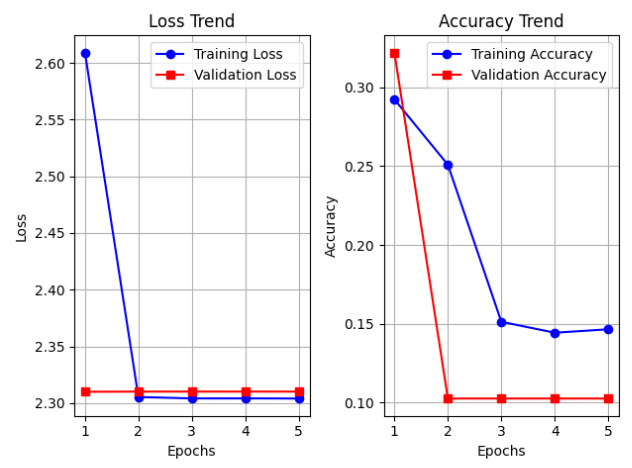

# Logo Classification with Convolutional Neural Network

This project focuses on classifying logos into 10 categories based on their brand's area of activation using a Convolutional Neural Network (CNN) built in PyTorch. The model is trained on a Kaggle dataset and predicts logos fetched from the Clearbit Logo API or website favicons. Initially, I intended to classify the logos based on their style - such as word-only, modern, vintage, and cartoon - but I couldn't find a sufficiently large dataset for my model to learn from.

## Dataset

### Training and Validation Data
The model is trained and validated using a dataset from **Kaggle**:  
[Logo Dataset – 2341 Classes & 167140 Images](https://www.kaggle.com/datasets/siddharthkumarsah/logo-dataset-2341-classes-and-167140-images)

The dataset includes **10 logo categories** based on brand industry:
- **Accessories**
- **Clothes**
- **Cosmetic**
- **Electronic**
- **Food**
- **Institution**
- **Leisure**
- **Medical**
- **Necessities**
- **Transportation**

### Data Preprocessing
To prepare the dataset:
1. Read images from subdirectories (each representing a class).
2. Convert images to grayscale using OpenCV.
3. Resize images to 100×100 pixels for uniformity.
4. Compute one-hot encoding for labels.
5. Store image arrays and labels in a dataset list.
6. Handle class imbalance by computing a `class_count` array to track the number of samples per class.

---

## Prediction Data

1. Parse the dataset using pandas to extract domain names.
2. Retrieve logos from websites using:
   - Clearbit Logo API (logos based on domain names).
   - Website favicons (fallback for missing logos).
3. Handle errors (e.g., HTTP errors, invalid images).
4. Convert each logo to grayscale, resize it to 100×100, and store it as a NumPy array.
5. Due to API limitations and missing images, only ~85% of website logos could be fetched.

---

## Convolutional Neural Network Architecture

The **CNN is implemented in PyTorch with CUDA** for acceleration.

### Model Components
The `NeuralNet` class contains:

- **`__init__()`** – Defines the architecture:
  - 3 convolutional layers
  - Batch normalization after each conv layer
  - 2 fully connected layers
  - Dropout for overfitting prevention

- **`convs()`** – Passes input through:
  - Conv layers
  - Batch normalization
  - ReLU activation
  - Max pooling

- **`forward()`** – Fully connected layers:
  - Passes data through FC layers, ReLU activation, dropout, and outputs logits.

- **`predict()`** – Converts logits to probabilities using Softmax and selects the highest probability as the predicted class.

---

## Training Process

1. Convert dataset into PyTorch tensors and save for efficient loading.
2. Use Cross-Entropy Loss with class weights (due to class imbalance).
3. Train using AdamW optimizer (`lr=0.001`).
4. Use a scheduler that decreases the learning rate by 0.7 every 2 epochs for better convergence.
5. Batch size = 64 for better learning efficiency.
6. Training loop:
   - Perform backpropagation.
   - Track training loss, validation loss, and validation accuracy.
   - Use tqdm to monitor progress.

### Model Training Efficiency
- Only 100k/216k items of the training dataset, 20k/50k items of the validation dataset and only 10 epochs (due to GPU limitations).
- Trained on a low-end GPU, making efficiency optimizations necessary.

---

## Generating Predictions

- A function extracts logos from websites.
- The CNN classifies logos into one of the 10 predefined categories.
- Predictions are saved in a JSON file (`predictions.json`).

---

## Future Improvements

- A cleaner and balanced training dataset.
- Increase training epochs on a better GPU.
- Use data augmentation to improve generalization.
- Improve logo retrieval using additional APIs.

---

## Conclusion and Future Improvements

Currently, the project has not yet achieved successful logo classification, as additional training is necessary.

Future Improvements:

- Curate a cleaner and more balanced training dataset.
- Increase the number of training epochs using a more powerful GPU.
- Experiment with a wider range of hyperparameters. While I tested with around five different combinations, the results are still not at an optimal point.
- Implement data augmentation techniques to enhance model generalization.
- Enhance logo retrieval functionality by incorporating additional APIs.

